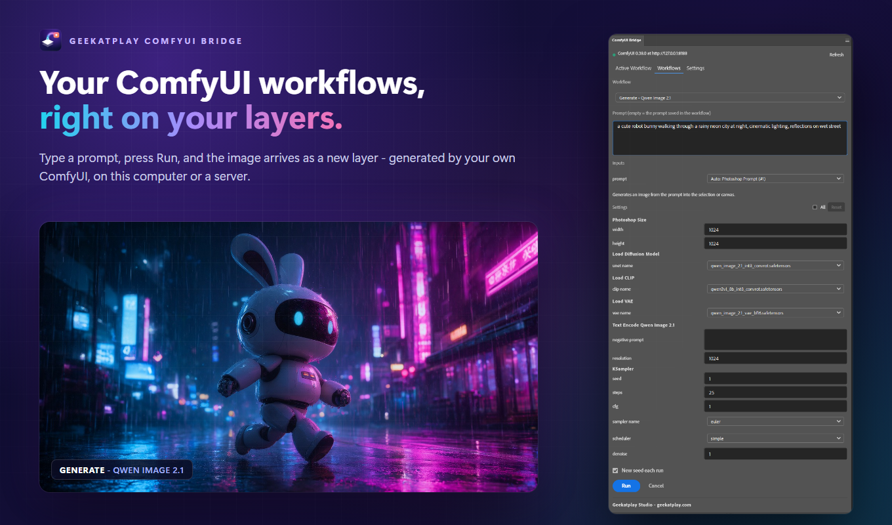
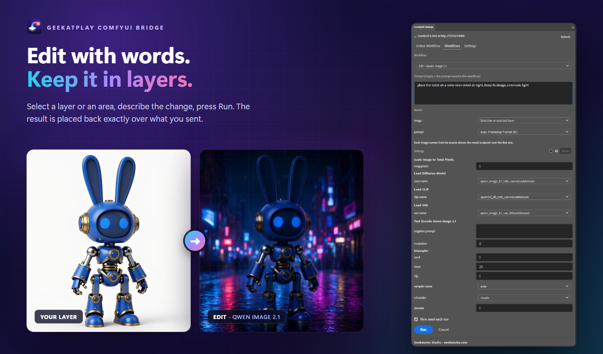
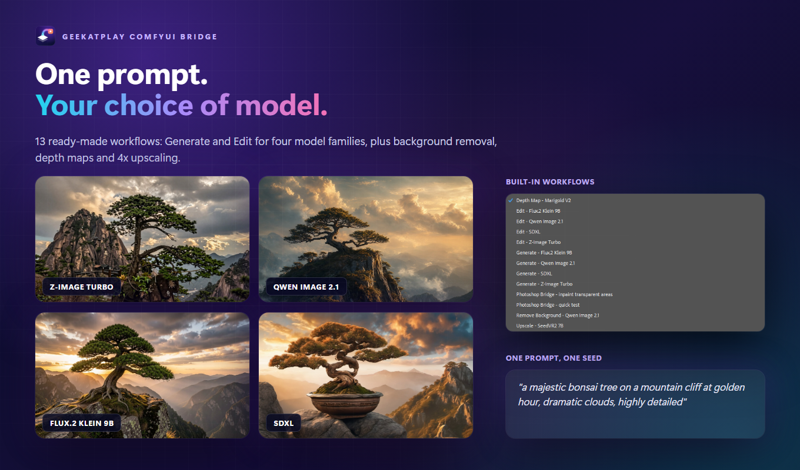
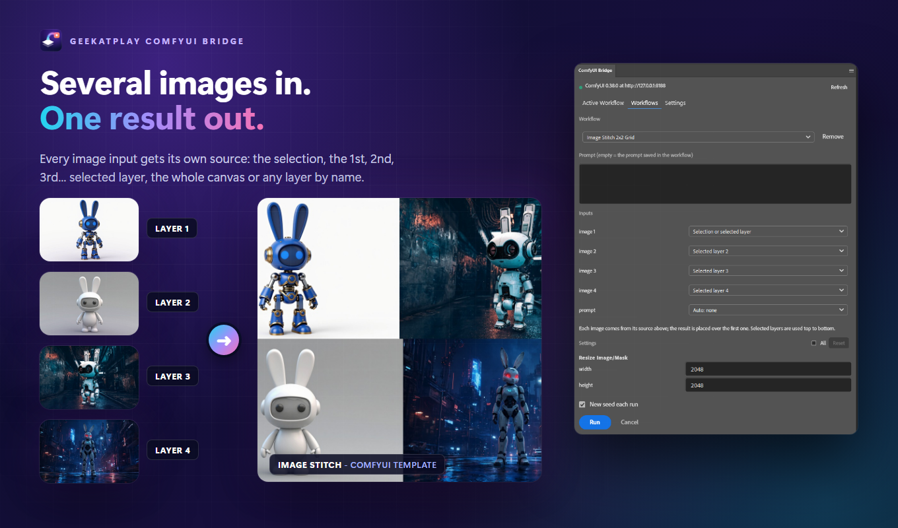
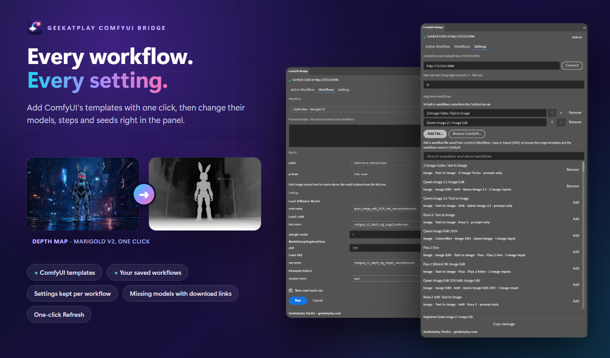

# Geekatplay Photoshop Bridge for ComfyUI

**Generate and edit images in Photoshop with your own ComfyUI - local or remote.**

By **Geekatplay Studio - Vladimir Chopine** - [www.geekatplay.com](https://www.geekatplay.com)



- **Generate** - type a prompt, get a new layer in the shape of the selection or canvas.
  Built-in workflows for **Z-Image Turbo, Qwen Image, Flux.2 Klein and SDXL** are ready
  right after installation.
- **Edit** - send a selection or a layer with an instruction; the result comes back as a
  new layer exactly over the area you sent.
- **One click tools** - remove the background, make a depth map, upscale 4x.
- **Any workflow** - browse ComfyUI's own templates and your saved workflows and add them
  with one click, or add a workflow file. The panel finds where the layer and the prompt
  go, and gives every image input its own source: the selection, the 1st, 2nd... selected
  layer, the whole canvas or a named layer.
- **Every setting at hand** - model files, steps, seed, strength, size and upscale options
  as fields in the panel, kept per workflow. Missing models come with their download links.
- **Work live** - push a layer into the workflow open in ComfyUI, tweak and re-run there,
  and every result lands in Photoshop.
- **Local or remote** ComfyUI, queue position and step progress in the panel, one-click
  installers for Windows and macOS. Results are placed as **smart objects**; 8 and 16
  bits/channel documents; layer transparency arrives in ComfyUI as a mask.

| | |
| --- | --- |
|  |  |
|  |  |

## Contents

- [Requirements](#requirements)
- [Install](#install)
- [First run](#first-run)
- [Using the panel](#using-the-panel)
- [Built-in workflows](#built-in-workflows)
- [Your own workflows](#your-own-workflows)
- [Nodes](#nodes)
- [Settings](#settings)
- [Troubleshooting](#troubleshooting)
- [Uninstall](#uninstall)
- [Privacy](#privacy)
- [Development](#development)

## Requirements

| | |
| --- | --- |
| ComfyUI | A current version (tested with ComfyUI 0.38, frontend 1.53). No extra Python packages. |
| Photoshop | 2024 (25.0) or newer, Windows or macOS (tested with Photoshop 2026 on Windows). |
| Creative Cloud app | Needed for the one-click panel install. |
| Models | Only for the workflows you use - see [Built-in workflows](#built-in-workflows). |

## Install

There are two parts: **nodes** for ComfyUI and a **panel** for Photoshop. One installer
sets up both. Before you start:

- ComfyUI is installed (portable, desktop or git) - it does not need to be running.
- Photoshop 2024 or newer is installed.
- The Adobe **Creative Cloud** app is installed and signed in - it installs the panel.

### Windows and macOS - one click

1. Download this repository (**Code > Download ZIP**) and unzip it anywhere.
2. Run the installer:
   - **Windows** - double-click `install.bat`
     (if Windows shows "Windows protected your PC": **More info > Run anyway**)
   - **macOS** - double-click `install.command`
     (first time: right-click > **Open** > **Open**)
3. Answer its question about the ComfyUI folder. It finds common locations by itself and
   otherwise opens a folder picker. Pick the folder that contains `custom_nodes` (for the
   portable version, the `ComfyUI` folder inside it).
4. Wait for **Done**. Every step prints `OK`, or `!!` with what to do instead.
5. **Restart ComfyUI.** In Photoshop open
   **Plugins > Geekatplay ComfyUI Bridge > ComfyUI Bridge** (restart Photoshop if the menu
   entry is not there yet).

What the installer does:

1. Copies the nodes to `ComfyUI/custom_nodes/ComfyUI-Geekatplay-Photoshop`
   (skipped when you run it from inside `custom_nodes`, for example after `git clone`).
2. Packs the panel into `build/GeekatplayComfyUIBridge.ccx`.
3. Installs the panel with Adobe's plugin installer, replacing any earlier version and
   keeping the panel's settings. If the plugin installer is not available it shows the
   manual steps below.

It does not download models or change ComfyUI's settings, and needs no extra Python
packages.

Options, for scripted installs:

| Windows (`install.bat`) | macOS (`install.command`) | |
| --- | --- | --- |
| `install.bat -ComfyUI "D:\ComfyUI"` | `./install.command ~/ComfyUI` | Install into this ComfyUI folder without asking. |
| `install.bat -SkipPhotoshop` | - | Only the ComfyUI nodes, for example on a server. |
| `install.bat -NoPause` | - | Do not wait for a key at the end. |

### Check that it works

1. The dot at the top of the panel is **green** and shows the ComfyUI version.
2. **Settings** says *13 built-in workflows come from the ComfyUI server*.
3. On the **Workflows** tab pick **Photoshop Bridge - quick test**, select a layer and press
   **Run**. An inverted copy of the layer appears as a new layer (no models needed).

If the dot stays red or the count is missing, see [Troubleshooting](#troubleshooting).

### Manual install

**Nodes** - clone into `custom_nodes`, or copy the unzipped folder there, then restart
ComfyUI:

```bash
cd ComfyUI/custom_nodes
git clone https://github.com/GeekatplayStudio/ComfyUI-Photoshop
```

ComfyUI-Manager can also install it from this repository's URL.

**Panel** - either:

- Run the installer; it builds `build/GeekatplayComfyUIBridge.ccx`. Double-click that file
  with the Creative Cloud app running and confirm **Install**.
- For development: in the Adobe UXP Developer Tool choose **Add Plugin**, select
  `photoshop/manifest.json`, then **Load**.

### ComfyUI on another computer

1. On the ComfyUI computer install the nodes (git clone above, or the installer with
   `-SkipPhotoshop`) and start ComfyUI with `--listen`, for example
   `python main.py --listen 0.0.0.0`.
2. On the Photoshop computer run the installer and press **Cancel** when it asks for the
   ComfyUI folder - only the panel is installed.
3. In the panel open **Settings**, enter the address (for example
   `http://192.168.1.20:8188`) and press **Connect**.

### Updating

1. Download the new version (or `git pull` in
   `ComfyUI/custom_nodes/ComfyUI-Geekatplay-Photoshop`).
2. Run the installer again. It replaces the panel in place and Photoshop reloads it right
   away; if a panel was open, close and reopen it.
3. **Restart ComfyUI**, then press **Refresh** in the panel.

The panel tells you when ComfyUI is still running an older version of the nodes. The
installer keeps your server address, added workflows and their settings.

## First run

1. Start ComfyUI and open any document in Photoshop.
2. The dot at the top of the panel is green when ComfyUI is reachable.
3. Open the **Workflows** tab, pick **Generate - Z-Image Turbo** (or Qwen, Flux, SDXL),
   type a prompt and press **Run**. The image arrives as a new layer.
4. No models yet? Pick **Photoshop Bridge - quick test** and press **Run**; it inverts the
   selected layer and proves the round trip works.

## Using the panel

### Workflows tab - run a workflow from Photoshop

Pick a workflow, type a prompt, press **Run**. ComfyUI runs it without the browser.

| The workflow has | What is sent | Where the result goes |
| --- | --- | --- |
| an image input (**Edit**) | With a selection: the visible pixels inside its bounds. Without: the selected layer. | A new layer over that area. |
| no image input (**Generate**) | Only the prompt. The image is generated in the shape of the target. | The selection, or the whole canvas. |

- An empty prompt keeps the prompt saved in the workflow.
- **Inputs** lists every image the workflow takes and where it comes from - see
  [Workflows with several images](#workflows-with-several-images) - and which node
  receives the prompt.
- **Settings** shows the workflow's own settings (steps, seed, model files, strength,
  upscale factor...) as fields you can change; the values are kept per workflow. **All**
  lists every widget, **Reset** returns to the values saved in the workflow.
- **Refresh** (next to the connection status) reads everything from ComfyUI again: the
  model lists, the built-in workflows, the template list and the selected workflow. Press
  it after adding models, editing a workflow in ComfyUI or restarting ComfyUI.
- **New seed each run** gives every `seed` / `noise_seed` a new value.
- When you run a workflow that loads other models than the previous one, the panel first
  asks ComfyUI to unload its models and clear its cache, so the new models start with
  free memory. Running the same models again keeps them loaded.
- The status line shows the queue position and sampler steps. **Cancel** stops your jobs.
- **Copy message** copies the status and error text, for example to report a problem.

### Active Workflow tab - work with the workflow open in ComfyUI

1. In ComfyUI open a workflow that has a **Photoshop Image** node and a
   **Send to Photoshop** node (every built-in Edit workflow does).
2. In Photoshop make a selection or select a layer, optionally type a prompt, and press
   **Send Layer to ComfyUI**. The Photoshop Image nodes switch to it; the prompt goes to
   the Photoshop Prompt nodes.
3. Press **Run** in ComfyUI. Each result is placed in Photoshop over the area you sent.
   Change the workflow and run again as often as you like.

Turn off *Place results from ComfyUI as new layers* to stop receiving results.

## Built-in workflows

They come with the nodes and are listed in the panel as soon as it connects - nothing to
register. In ComfyUI they are under **Templates > Extensions**, in the entry named after
this pack's folder, so you can open them and change models or settings. The files are in
`example_workflows/`.

| Workflow | Model files it loads | Notes |
| --- | --- | --- |
| Generate / Edit - Z-Image Turbo | `z_image_turbo_bf16`, `qwen_3_4b`, `ae` | 8 steps. Edit is image-to-image (denoise 0.6). |
| Generate / Edit - Qwen Image 2.1 | `qwen_image_2.1_int8_convrot`, `qwen3vl_8b_int8_convrot`, `qwen_image_2.1_vae_bf16` | Edit follows instructions ("make it winter"). |
| Remove Background - Qwen Image 2.1 | same as Qwen Image 2.1 | Returns the subject on a transparent background. Leave the prompt empty. |
| Generate / Edit - Flux.2 Klein 9B | `flux-2-klein-9b-fp8`, `qwen_3_8b_fp8mixed`, `flux2-vae` | 4 steps. Edit follows instructions. |
| Generate / Edit - SDXL | `sd_xl_base_1.0` | Edit is image-to-image (denoise 0.6). |
| Depth Map - Marigold V2 | `qwen_image_edit_2509_int8_convrot`, `marigold_v2_depth_log_stage2` (LoRA), `marigold_v2_depth_log_stage2_vae`, `marigold_v2_depth_conditioning` (embeddings) | Turns the layer into a depth map. No prompt. |
| Upscale - SeedVR2 7B | `seedvr2_7b_int8_convrot`, `seedvr2_ema_vae_fp16` | Upscales the layer 4x and restores detail. Keeps transparency. No prompt. The result is fitted back over the layer, so use it on a larger canvas or copy it to a new document for the full size. |
| Photoshop Bridge - inpaint transparent areas | `sd_xl_base_1.0` | Regenerates the erased (transparent) parts of a layer. |
| Photoshop Bridge - quick test | none | Inverts the layer. |

All files are `.safetensors` in the usual ComfyUI model folders. If a file is missing,
ComfyUI's message names it - open the workflow in ComfyUI and pick the file you have.
The first run of a model takes longer while it loads.

## Your own workflows

Two ways to add workflows, both under **Settings**:

- **Browse ComfyUI...** lists the official ComfyUI templates that run on your own
  machine and make an image (Z-Image, Qwen Image, Flux, SDXL, upscalers, background
  removal, image stitching...) plus every workflow you saved in ComfyUI. Search, press
  **Add**. They are fetched from the connected ComfyUI, so this also works with a remote
  server. Templates whose models you do not have show a *Missing models* note with a
  **Copy download links** button.
- **Add File...** picks a workflow file - a regular save (**Workflow > Save**) or an API
  export (**Workflow > Export (API)**).

Rename an entry in place and reorder it with the arrows under **Settings**. The source is
read again before every run, so edits made in ComfyUI are picked up; if it is gone, the
copy saved at registration is used.

To delete an added workflow, press **Remove** next to it - on the Workflows tab beside the
workflow picker, in the **Settings** list, or in **Browse ComfyUI...**. This takes it off
the panel's list together with its saved inputs and settings; the workflow file and
ComfyUI's templates are not deleted, so you can add it again any time. Built-in workflows
cannot be removed.

### Workflows with several images

Every Load Image node the workflow reads becomes an **image slot** under **Inputs**, named
after the input it feeds (`image1`, `reference_image2`...). Each slot has its own source:

| Source | What is sent |
| --- | --- |
| Selection or selected layer | The visible pixels inside the selection; without one, the topmost selected layer. The default for the first slot. |
| Selected layer 1, 2, 3... | The selected layers counted from the top of the Layers panel. Ctrl/Cmd-click several layers and they fill the slots in order - the default for the other slots. |
| Whole canvas | Everything visible. |
| Layer: *name* | That layer, wherever it is. |
| Keep the workflow's image | The file saved in the workflow. |

The result is placed over the first layer sent. A layer used by two slots is uploaded
once.

### Settings the panel shows

The panel first shows the settings the workflow author put forward - widgets promoted onto
a subgraph (what the ComfyUI templates do) and titled primitive nodes - then the usual
sampling, size, strength, upscale and model inputs, grouped by node. **All** adds every
other value. Options that belong to a mode (for example the multiplier of *scale by
multiplier*) are shown for the mode saved in the workflow; switch the mode itself in
ComfyUI. Inputs wired to other nodes are not shown.

### How the panel finds the right nodes

The panel has to know which node receives the layer and which the prompt. It decides in
this order and shows the outcome under **Inputs**:

1. **Photoshop nodes.** `Photoshop Image`, `Photoshop Prompt` and `Photoshop Size` say
   exactly where things go. Put them in a workflow and nothing is guessed.
2. **Titles.** A Load Image or text node whose title contains "Photoshop" is used. Rename
   a node in ComfyUI to mark it without rewiring anything.
3. **Structure.** Otherwise: every Load Image node something reads, and the text that
   feeds the sampler's *positive* input - the negative prompt is left alone, also behind ControlNet
   and guidance nodes. For generated images the Empty Latent size is set to the shape of
   the target area, keeping the workflow's pixel count.
4. **You choose.** If several text nodes fit, the panel asks you to pick under **Inputs**
   and remembers the choice for that workflow. Image nodes never need a choice: each one
   is a slot with its own source.

Results are taken from Send to Photoshop nodes; without one, from saved images, then
from previews.

Regular saved workflows are converted the way ComfyUI does when you press Run, using the
node definitions of the connected server: subgraphs, reroutes, primitives, bypassed and
muted nodes are handled, and nodes the server does not have are reported by name. The 3D
viewer and webcam nodes cannot be converted; register an API export for those workflows.

## Nodes

Category **Geekatplay Studio/Photoshop**.

| Node | What it does |
| --- | --- |
| **Photoshop Image** | Load Image for pixels sent from Photoshop (stored in `input/photoshop`). Outputs IMAGE and a MASK from the transparency. |
| **Photoshop Prompt** | Text output that the panel replaces with the typed prompt. Connect it to a text input such as CLIP Text Encode. |
| **Photoshop Size** | Width and height for an empty latent. The panel sets them to the shape of the selection or canvas, keeping about the same number of pixels. |
| **Send to Photoshop** | Saves the images to `output/Photoshop` and hands them to the panel. |

## Settings

| Setting | |
| --- | --- |
| ComfyUI server | Address of ComfyUI, `http://127.0.0.1:8188` by default. |
| Max size sent | Scales what is sent so its long edge fits; `0` sends full size. The result is still fitted to the original area. |
| Registered workflows | Workflows added from ComfyUI's templates, from ComfyUI's saved workflows or from files. Built-in workflows come from the server and are not listed here. |

Pixels travel uncompressed. An area larger than ComfyUI's upload limit (100 MB by
default, about 5000 x 5000 pixels) needs a lower *Max size sent* or ComfyUI started with
`--max-upload-size`.

## Troubleshooting

| What you see | What to do |
| --- | --- |
| Red dot, *Cannot reach ComfyUI* | Start ComfyUI and check the address in Settings. A remote ComfyUI needs `--listen`. |
| *ComfyUI is running but the ... nodes are not loaded* | Install the nodes on that ComfyUI and restart it. |
| *Restart ComfyUI to load the built-in workflows* | The nodes were updated while ComfyUI was running. Restart it. |
| *Value not in list* naming a model file | That model is not installed. Open the workflow in ComfyUI and choose a file you have. |
| *several nodes that could receive the prompt* | Pick the node under **Inputs** on the Workflows tab. |
| *Select at least N layers* | The workflow has N image slots. Select that many layers, or give each slot a source under **Inputs**. |
| *Missing models: ...* | Press **Copy download links**, download the files into the named model folders and press **Refresh**. |
| A model, template or workflow you just added does not show, or a note says a model is missing although the workflow runs | Press **Refresh** in the panel header. |
| *... is not installed on this ComfyUI server* | Your workflow uses a custom node this server does not have. |
| *The layer is larger than the ComfyUI upload limit* | Lower *Max size sent*, or start ComfyUI with `--max-upload-size`. |
| *32-bit documents are not supported* | Image > Mode > 16 Bits/Channel. |
| A built-in workflow opened in ComfyUI warns about a missing image | Expected until you send a layer to it. |
| The installer cannot install the panel | Open the Creative Cloud app, sign in, then double-click `build/GeekatplayComfyUIBridge.ccx`. |
| *no such file or directory* when a result is placed, right after updating the panel | The open panel is the old copy. Close the panel and reopen it from **Plugins**, or restart Photoshop. |
| The panel's icon is empty or old when the panel is collapsed in a dock | Restart Photoshop once after installing - it reads dock icons at startup. |
| `ConnectionResetError: [WinError 10054]` in the ComfyUI console | Harmless Windows message when a client drops its connection; ComfyUI keeps running. |

Good to know:

- Scrolling the mouse wheel over a dropdown changes its value (a Photoshop panel
  behaviour); scroll with the cursor over a label or empty space instead.
- A selection is sent as its bounding rectangle. Transparent pixels inside it are sent
  as black.
- Image-to-image edits (Z-Image, SDXL) keep the composition and change the look; use the
  Qwen or Flux edit workflows for instructions such as "replace the sky".

## Uninstall

- **Panel** - in Photoshop choose **Plugins > Manage Plugins...** and uninstall
  *Geekatplay ComfyUI Bridge*, or run Adobe's plugin installer:
  - Windows: `"%CommonProgramFiles%\Adobe\Adobe Desktop Common\RemoteComponents\UPI\UnifiedPluginInstallerAgent\UnifiedPluginInstallerAgent.exe" /remove "Geekatplay ComfyUI Bridge"`
  - macOS: `"/Library/Application Support/Adobe/Adobe Desktop Common/RemoteComponents/UPI/UnifiedPluginInstallerAgent/UnifiedPluginInstallerAgent.app/Contents/MacOS/UnifiedPluginInstallerAgent" --remove "Geekatplay ComfyUI Bridge"`
- **Nodes** - delete the pack's folder from `ComfyUI/custom_nodes`.

## Privacy

The panel talks only to the ComfyUI address you enter, stores its settings in Photoshop's
plugin storage and sends nothing anywhere else - no accounts, analytics or telemetry. See
[PRIVACY.md](PRIVACY.md).

## Development

```
nodes.py, routes.py     ComfyUI nodes and the HTTP routes the panel uses
web/                    ComfyUI frontend extension (switches the Photoshop nodes)
photoshop/              the Photoshop panel (UXP plugin)
example_workflows/      built-in workflows, also shown in ComfyUI's Templates
installer/, install.*   installers
distribution/           Adobe Marketplace listing: text, icons, screenshots, sources
tests/                  tests
```

Panel icons: the manifest names `icons/<name>.png`, while the files are
`icons/<name>@1x.png` and `icons/<name>@2x.png`. On Windows, Photoshop does not find a
1x file named without `@1x`, and the collapsed panel then shows an empty icon. Panel
icons also need `"species": ["chrome"]` (the convention in Adobe's UXP samples).

```bash
node --test "tests/*.test.js"
python tests/bridge_e2e.py --base http://127.0.0.1:8188
python distribution/check_listing.py
```

Publishing to Adobe's Creative Cloud Marketplace is described step by step in
[distribution/README.md](distribution/README.md).

## License

MIT - see [LICENSE](LICENSE). Copyright (c) Geekatplay Studio - Vladimir Chopine.
Test fixtures in `tests/fixtures/convert` come from the ComfyUI workflow templates (MIT).
